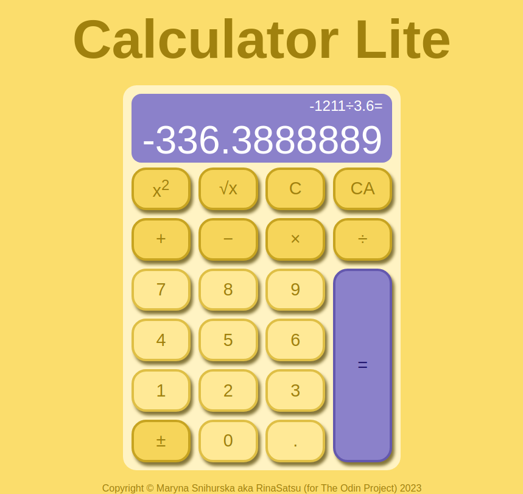

# Calculator-lite
Welcome to the Calculator Lite! This calculator provides a range of functions for basic arithmetic operations, including addition, subtraction, multiplication, and division. Additionally, you can perform square, square root, and change sign operations. This calculator showcases front-end development skills using HTML, CSS, and JavaScript. The project adheres to MVC (Model-View-Controller) principles, demonstrating a structured architecture without relying on additional modules.

## Motivation
The primary goal of this project is to highlight proficiency in front-end technologies, emphasizing:

**HTML**: Used to structure the content and layout of the calculator.

**CSS**: Handles styling and design elements, ensuring a visually appealing and user-friendly interface.

**JavaScript**: Powers the interactivity and functionality of the calculator, incorporating **MVC** principles for a clean and organized codebase.

## Features
**Addition (+)**: Add numbers together for simple arithmetic.

**Subtraction (-)**: Subtract one number from another.

**Multiplication (x)**: Multiply two numbers to get the result.

**Division (/)**: Divide one number by another.

**Square (x²)**: Square a number, multiplying it by itself.

**Square Root (√)**: Find the square root of a number.

**Change Sign (+/-)**: Switch between positive and negative values.

**History Tracking**: View a record of your calculation.

**Clear Last (C)**: Delete the last entered symbol or operation. If the last operation was '=', it removes the history.

**Clear All (CA)**: Delete everything, including the current number.

**Repeated Equals (=)**: Pressing '=' multiple times consecutively will repeat the last operation.

### Repeated Equals and Other Operations
If you press the '=' button multiple times consecutively, the calculator will repeat the last operation. This feature allows for quick calculations without re-entering the entire expression.

#### Examples
* To calculate 10 + 5, press '10', '+', '5', and '=', resulting in '15'.
* To perform consecutive calculations like 10 + 5 + 5 + 5, continue pressing '=' two more times, resulting in '25'.
* To find the square root of 25, press '5', and '√', resulting in '5'. Press '√' again to get '2.236067977'.

## How to Use
1. **Numeric Buttons**: Use the numeric buttons to enter numbers.

2. **Operation Buttons**: Select the operation you want to perform (+, -, x, /, x², √, +/-).

3. *(Optional)* Enter second number using buttons.

4. **Clear Last (C) Button**: You can change number or operation by deleting with 'C' button.

5. **Change Sign (+/-) Button**: Switch between positive and negative values.

6. **Equals (=) Button**: Press the '=' button to calculate the result.

7. **Clear All (CA) Button**: Delete everything to beging new chain of calculations.

## Feedback and Issues
If you encounter any issues or have suggestions for improvements, please open an issue on the GitHub repository. Your feedback is valuable and will contribute to the enhancement of this calculator.

### Credits
This project was created with passion by Maryna Snihurska (aka RinaSatsu). Special thanks to The Odin Project for their idea of this project.

Enjoy calculating with the Calculator Lite!
